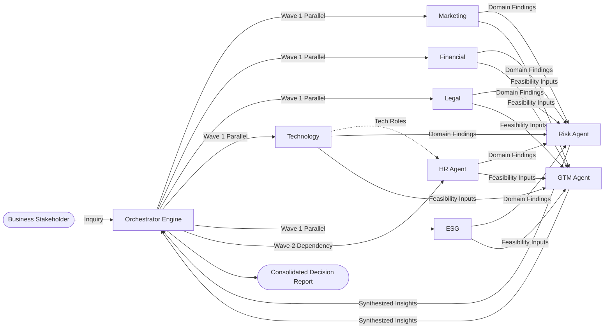
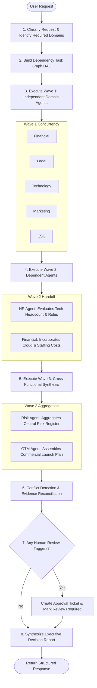
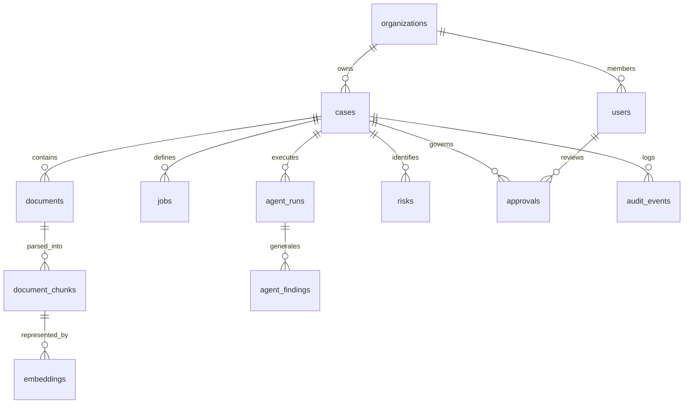
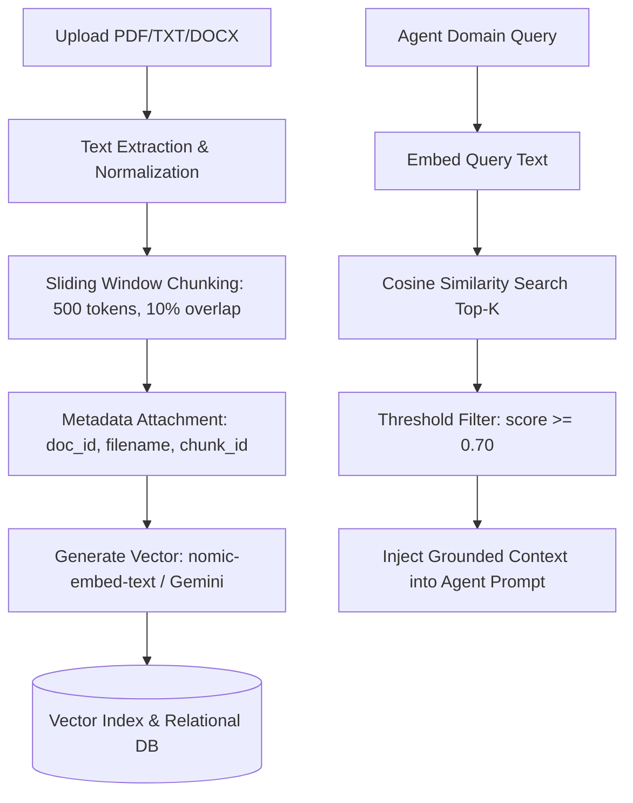
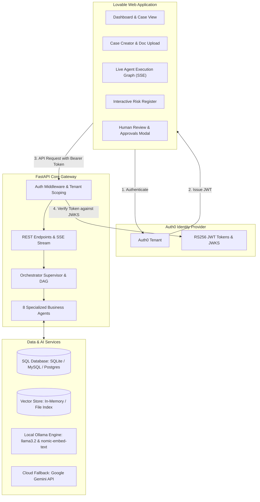
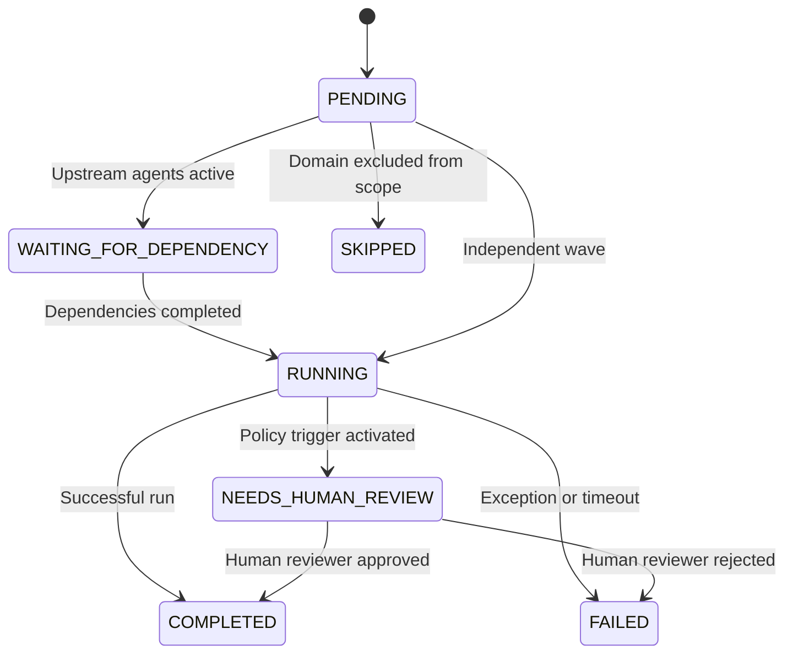

# FinTech Multi-Agent Platform
## System Requirements Blueprint & Architectural Specification
**Marketing • Financial • Legal • Technology • HR • ESG • GTM • Risk • Orchestrator**

---

### Table of Contents
1. [Executive Summary](#1-executive-summary)
2. [Problem Statement & Master Question](#2-problem-statement--master-question)
3. [Goals and Non-Goals](#3-goals-and-non-goals)
4. [Agent Inventory and Responsibilities](#4-agent-inventory-and-responsibilities)
5. [Common Agent Contract & Schemas](#5-common-agent-contract--schemas)
6. [Detailed Requirements by Agent](#6-detailed-requirements-by-agent)
7. [Orchestrator & Supervisor Specification](#7-orchestrator--supervisor-specification)
8. [End-to-End Execution Workflow](#8-end-to-end-execution-workflow)
9. [Shared Data Model (13 Entities)](#9-shared-data-model-13-entities)
10. [Knowledge & Retrieval Architecture (RAG)](#10-knowledge--retrieval-architecture-rag)
11. [SaaS Architecture (Lovable + Auth0 + FastAPI)](#11-saas-architecture-lovable--auth0--fastapi)
12. [Security, Isolation & Governance](#12-security-isolation--governance)
13. [Standard Agent State Machine](#13-standard-agent-state-machine)
14. [Evaluation & Quality Assurance Strategy](#14-evaluation--quality-assurance-strategy)
15. [REST API Specification](#15-rest-api-specification)
16. [Implementation Roadmap (Phases 1–10)](#16-implementation-roadmap-phases-110)
17. [Faculty & Viva Defense Talking Points](#17-faculty--viva-defense-talking-points)
18. [System Requirements Checklist](#18-system-requirements-checklist)
19. [Current Project Baseline](#19-current-project-baseline)
20. [Practical Next Steps & Extensions](#20-practical-next-steps--extensions)

---

## 1. Executive Summary

The **FinTech Multi-Agent Platform** is an enterprise-ready decision-support system designed to evaluate complex financial, technical, and regulatory business initiatives. Instead of relying on a single monolithic Large Language Model (LLM)—which suffers from hallucinations, poor math accuracy, lack of auditability, and uncontrolled access to data—the platform decomposes complex problems across **eight specialized autonomous domain agents**:

1. **Marketing Agent**: Customer segmentation, positioning, channels, and campaigns.
2. **Financial Agent**: Unit economics, break-even analysis, cash burn, and financial forecasting.
3. **Legal Agent**: Regulatory compliance (e.g., RBI guidelines, DPDP Act 2023), contracts, and compliance risks.
4. **Technology Agent**: Architecture feasibility, cloud scalability, tech stack, APIs, and cybersecurity posture.
5. **HR Agent**: Headcount planning, skill-gap analysis, candidate resume evaluation, and hiring timelines.
6. **ESG Agent**: Environmental impact (data center compute), social inclusion, and corporate governance compliance.
7. **Go-To-Market (GTM) Agent**: Launch milestones, distribution channels, pricing strategy, and commercial rollout.
8. **Risk Agent**: Centralized cross-functional Risk Register, severity matrix, and mitigation planning.

An **Orchestrator (Supervisor)** oversees the entire lifecycle: classifying user inquiries, constructing a dependency-aware Directed Acyclic Graph (DAG), dispatching parallel and sequential execution waves, minimizing shared context to adhere to the principle of least privilege, reconciling conflicting findings, and synthesizing an executive decision-support report.



---

## 2. Problem Statement & Master Question

### The Business Challenge
Before launching a financial product, entering an international market, or executing an acquisition, modern enterprises must solicit input from legal counsel, risk officers, chief technology architects, CFOs, CMOs, and HR directors. In practice:
- Analysis happens in organizational silos, causing weeks of delay.
- Manual cross-referencing of documents leads to overlooked regulatory clauses or underbudgeted infrastructure.
- Monolithic chatbots fail because they cannot perform deterministic calculations, have no tenant isolation, hallucinate facts, and leak confidential cross-departmental data.

### Master Demonstration Scenario
> **"Should we launch an AI-enabled lending product for Small and Medium Enterprises (SMEs) in India?"**

This question spans multiple domains:
- **Financial**: Can we achieve positive unit economics with a 14–18% APR given SME default rates and customer acquisition cost (CAC)?
- **Legal**: Does the platform comply with the Reserve Bank of India (RBI) Digital Lending Directions (2022) and the Digital Personal Data Protection (DPDP) Act (2023)?
- **Technology**: What infrastructure is needed to handle 10,000 credit score evaluations per minute with sub-second latency and bank-grade ISO 27001 / SOC 2 security?
- **HR**: Do we have qualified credit-underwriting engineers and MLOps talent to maintain the models?
- **Marketing**: How do we reach Tier-2 and Tier-3 Indian SME owners through regional channels?
- **ESG**: Does digital lending foster financial inclusion for underserved micro-enterprises without predatory collection practices?
- **Risk**: What happens if the credit default rate surges by 5% during an economic downturn?
- **GTM**: How should we phase the launch across regions and partner with Non-Banking Financial Companies (NBFCs)?

---

## 3. Goals and Non-Goals

### System Goals
- **Domain Specialization**: Dedicated agents with distinct system instructions, focused domain knowledge, and targeted tools.
- **Dependency-Aware Orchestration**: Dynamic task planning that runs independent tasks in parallel and sequences dependent tasks.
- **Traceable Grounding (Evidence-Based RAG)**: Every factual assertion must link to an explicit chunk/citation in provided documents.
- **Deterministic Tooling for Math**: Mathematical calculations (NPV, break-even, LTV/CAC) are strictly calculated by Python tools—never generated as LLM token guesses.
- **Human-in-the-Loop (HITL) Governance**: Automated trigger of review tickets for high-impact regulatory, financial, hiring, and risk decisions.
- **Enterprise SaaS Security**: Multi-tenant database isolation, Auth0-compatible JWT authentication, role-based access control (RBAC), and immutable audit logs.
- **Graceful Failure Handling**: If an individual agent fails, the orchestrator flags the section as incomplete and synthesizes available findings without crashing.

### Non-Goals
- **Autonomous Financial Execution**: The platform will **never** disburse loans, initiate bank transfers, or execute trades autonomously.
- **Unlicensed Legal/Financial Advice**: The system is strictly a decision-support tool. It outputs recommendations with explicit disclaimers and mandates certified human review.
- **Unrestricted Data Sharing**: Agents do not broadcast raw data across all peers; context is minimized and filtered by the Orchestrator.
- **Hallucinated Confidence**: The system will not output arbitrary confidence percentages without an objective, mathematical evaluation basis.

---

## 4. Agent Inventory and Responsibilities

| Agent | Primary Question | Key Deliverables | Upstream Dependencies | Deterministic Tools |
| :--- | :--- | :--- | :--- | :--- |
| **Marketing** | Who do we target and how do we communicate value? | Target personas, channel strategy, CAC assumptions, campaign themes. | Case description, market research docs. | Channel budget allocation calculator. |
| **Financial** | Are the unit economics and ROI viable under stated assumptions? | Revenue models, break-even timeline, cash burn, sensitivity analysis. | Tech infra estimates, Marketing CAC, GTM pricing. | Python financial math engine (Break-even, LTV/CAC, Cash Burn). |
| **Legal** | What regulatory barriers and compliance obligations apply? | Clause extractions, compliance gap analysis, privacy audit (DPDP/RBI). | Regulatory docs, terms of service, technical architecture. | Regulatory text extractor, compliance rule checklist. |
| **Technology** | Can we build, scale, and secure the system within constraints? | System architecture diagram, cloud tech stack, API design, security posture. | Business requirements, TPS expectations. | Cloud hosting cost calculator, latency/TPS estimator. |
| **HR** | Do we have the talent and skills required to execute the plan? | Candidate resume ranking, skill-gap identification, hiring timeline. | Tech role requirements, operational headcount. | Cosine similarity vector matcher, skill-matrix evaluator. |
| **ESG** | What environmental, social, and governance impacts exist? | Carbon footprint estimate, social inclusion index, governance checklist. | Cloud server tiers, credit underwriting policy. | Server power/emissions estimator, inclusion score matrix. |
| **GTM** | How do we commercialize and schedule the rollout? | Phase-wise launch schedule, partnership roadmap, commercial KPIs. | Validated outputs from Marketing, Tech, Legal, Finance. | Milestone scheduler, dependency tree validator. |
| **Risk** | What are the cross-functional failure modes and mitigations? | Central Risk Register, probability × impact scoring, mitigation plan. | Findings from all 7 domain agents. | Risk severity matrix (5×5 scoring), mitigation tracker. |
| **Orchestrator** | How should the workflow be planned, executed, and synthesized? | Dependency DAG, wave execution plan, conflict analysis, final report. | User request, tenant policies, agent outputs. | DAG topological sorter, context minimizer, synthesis engine. |

---

## 5. Common Agent Contract & Schemas

To enable consistent orchestration, every agent communicates using a strictly-typed JSON contract enforced via Pydantic schemas.

### 5.1 Agent Input Contract
```json
{
  "case_id": "CASE-2026-IND-01",
  "org_id": "ORG-FINTECH-GLOBAL",
  "user_request": "Should we launch an AI-enabled lending product for SMEs in India?",
  "business_context": "FinTech startup evaluating digital lending under RBI guidelines with INR 5,00,00,000 initial capital.",
  "document_refs": [
    "doc_rbi_digital_lending_guidelines_2022",
    "doc_india_dpdp_act_2023",
    "doc_sme_market_research_india"
  ],
  "constraints": {
    "budget_limit_inr": 50000000,
    "target_launch_months": 9,
    "target_geography": "India (Tier 1 & Tier 2 hubs)"
  },
  "requested_task": "Evaluate regulatory feasibility and compliance obligations.",
  "upstream_findings": []
}
```

### 5.2 Agent Output Contract
```json
{
  "agent": "legal",
  "case_id": "CASE-2026-IND-01",
  "status": "COMPLETED",
  "summary": "Digital lending is feasible in India provided loan disbursals flow directly between bank accounts without passing through third-party pool accounts.",
  "findings": [
    {
      "title": "Direct Disbursal Requirement",
      "description": "RBI guidelines mandate all loan servicing and disbursals execute directly from the Regulated Entity (RE) bank account to the borrower account.",
      "category": "Regulatory Compliance",
      "severity": "HIGH"
    }
  ],
  "calculations": {},
  "assumptions": [
    "The platform will partner with an RBI-licensed NBFC or Commercial Bank as the Regulated Entity."
  ],
  "data_gaps": [
    "Specific escrow mechanism details for loan repayments have not been provided."
  ],
  "risks": [
    {
      "risk_id": "RSK-LEG-001",
      "description": "Storing customer biometric or raw credit bureau data on non-Indian cloud servers violates DPDP Act and RBI data localization rules.",
      "probability": "HIGH",
      "impact": "CRITICAL",
      "mitigation": "Host all cloud instances and databases in Indian cloud regions (e.g., AWS ap-south-1)."
    }
  ],
  "dependencies": ["technology"],
  "sources": [
    {
      "document_id": "doc_rbi_digital_lending_guidelines_2022",
      "clause_or_chunk_id": "sec_4.1_direct_disbursal",
      "exact_citation": "All loan servicing, repayments, etc., shall be executed directly in the RE's bank account without any pass-through account."
    }
  ],
  "human_review_required": true,
  "review_reasons": [
    "Mandatory sign-off required from certified Indian legal counsel for lending partnership contract."
  ],
  "timestamp": "2026-09-05T14:30:00Z"
}
```

---

## 6. Detailed Requirements by Agent

### 6.1 Marketing Agent
- **Purpose**: Target persona analysis, market size, value proposition, and acquisition channels.
- **Inputs**: SME segment, geography, product profile, marketing budget.
- **Outputs**: Customer segments (micro vs small enterprises), messaging pillars, channel mix (digital, direct sales, NBFC referrals), estimated CAC.
- **Guardrails**: No fabricated customer counts or conversion percentages; any projection must be labeled as an assumption.

### 6.2 Financial Agent
- **Purpose**: Economic feasibility, unit economics, break-even analysis, cash burn, and financial sensitivity.
- **Inputs**: Projected loan volumes, interest rate spreads, default rate estimates, operating expenses.
- **Outputs**:
  - Break-Even Analysis: Break-Even Units = Fixed Costs / (Revenue per Loan - Variable Cost per Loan)
  - Unit Economics: LTV = (Net Margin per Loan * Average Loans per Customer) / Churn Rate
  - Cash Runway & Sensitivity tables under varying default rates (e.g., 2%, 5%, 8%).
- **Guardrails**: **Zero mental math by LLM.** Every metric is computed by deterministic Python functions.

### 6.3 Legal Agent
- **Purpose**: Regulatory compliance, clause extraction, licensing constraints, and privacy requirements.
- **Inputs**: RBI guidelines, DPDP Act clauses, lending partnership agreements.
- **Outputs**: Compliance checklists, data localization requirements, customer consent workflows, contractual risk flags.
- **Guardrails**: Mandatory human review flag whenever regulatory penalties or licensing laws are implicated.

### 6.4 Technology Agent
- **Purpose**: Architecture feasibility, stack selection, API contracts, scalability, and cloud security.
- **Inputs**: Expected TPS, credit decision latency limits, regulatory audit requirements.
- **Outputs**: Recommended microservice architecture, tech stack (FastAPI, Redis, PostgreSQL, Ollama/Gemini), API contracts, cloud hosting estimate (AWS/GCP India regions).
- **Guardrails**: System must explicitly designate high-availability zones and encrypt data at rest (AES-256) and in transit (TLS 1.3).

### 6.5 HR Agent (Self-Contained in Platform)
- **Purpose**: Workforce planning, skill-gap analysis, candidate resume evaluation, and hiring timelines.
- **Inputs**: Job specifications for engineering/underwriting, candidate resumes.
- **Outputs**: Semantic cosine similarity candidate rankings, matched skills, missing qualifications, hiring cost projections.
- **Guardrails**: **Strict Anti-Bias**: The agent is programmatically prohibited from extracting or inferring age, gender, race, religion, nationality, or marital status. AI acts solely as decision support—never makes final hiring decisions.

### 6.6 ESG Agent
- **Purpose**: Environmental footprint, social inclusion index, and corporate governance review.
- **Inputs**: Cloud compute tier, SME target demographic, lending policy.
- **Outputs**: Compute emissions estimate (kg CO2e), financial inclusion metrics (loans to unbanked female-led SMEs), governance audit trail validation.
- **Guardrails**: Differentiates between measured, estimated, and missing ESG disclosures. Never fabricates certifications.

### 6.7 GTM Agent
- **Purpose**: Commercialization, launch phases, partnership channels, and milestone management.
- **Inputs**: Marketing channels, legal approvals, tech readiness dates, financial runway.
- **Outputs**: Phased launch roadmap (Phase 1 Pilot, Phase 2 Regional Rollout, Phase 3 National Scale), commercial KPIs, and critical path blockers.
- **Guardrails**: Unresolved legal or technological blockers will automatically freeze the GTM launch readiness status.

### 6.8 Risk Agent
- **Purpose**: Cross-functional risk aggregation, severity scoring, mitigation assignment, and risk register management.
- **Inputs**: Findings, uncertainties, and data gaps from all other domain agents.
- **Outputs**: Central Risk Register with unique IDs (`RSK-001`), Probability (Low, Med, High), Impact (Low, Med, High, Critical), Severity Score (P * I), mitigation strategy, and assigned owner.
- **Guardrails**: Maintains `UNKNOWN` states when data is missing. Prohibits automated closure of high-severity risks.

---

## 7. Orchestrator & Supervisor Specification

The Orchestrator functions as a deterministic state machine and supervisor:



### Core Responsibilities
1. **Request Understanding**: Parses natural language prompts to detect required agents and extract constraints.
2. **Context Minimization**: Pass only relevant chunks to each agent to protect sensitive data and save tokens.
3. **Conflict Detection**: Detects contradicting claims (e.g., Marketing assumes 100,000 customers in Month 1 while Tech capacity is capped at 10,000). Both findings are preserved and flagged in the final report.
4. **Failure Isolation**: If one agent times out or fails, remaining branches proceed normally. The final report explicitly documents the incomplete domain.

---

## 8. End-to-End Execution Workflow

Here is the exact lifecycle when a user submits: *"Should we launch an AI-enabled lending product for SMEs in India?"*

1. **Case Inception**: The user creates `CASE-2026-001` in the dashboard and uploads supporting PDFs (`rbi_guidelines.pdf`, `cloud_architecture.pdf`, `resumes.pdf`).
2. **Authentication & Ingestion**: FastAPI verifies the Auth0 JWT token, creates database records, chunks documents into 500-token windows, and generates embeddings.
3. **Orchestrator Planning**: The Orchestrator constructs the 4-wave task graph.
4. **Execution Wave 1 (Parallel)**:
   - **Legal** queries the vector store for RBI compliance and identifies mandatory direct-disbursal rules.
   - **Technology** formulates the microservice stack and estimates cloud hosting costs.
   - **Marketing** maps Tier-2 SME acquisition strategies.
   - **ESG** calculates server carbon footprints and outlines social inclusion benefits.
   - **Financial** builds preliminary unit economics models.
5. **Execution Wave 2 (Dependent)**:
   - **HR** consumes the Technology role requirements (e.g., Senior Credit Risk MLOps Engineer) and scans candidate resumes for semantic matches.
   - **Financial** updates operational expenditure with the HR headcount and cloud hosting figures.
6. **Execution Wave 3 (Synthesis)**:
   - **Risk** reads findings from all agents and produces the Central Risk Register.
   - **GTM** checks milestones against technical readiness dates and regulatory lead times.
7. **Wave 4 (Governance & Delivery)**:
   - Orchestrator checks for conflicts and notes that Legal triggered `human_review_required=true` due to RBI lending licensing requirements.
   - An approval ticket is created in the `approvals` table.
   - Consolidated executive briefing report is returned to the user.

---

## 9. Shared Data Model (13 Entities)



### Entity Definitions
1. **`organizations`**: Multi-tenant isolation boundary (`id`, `name`, `created_at`, `tier`).
2. **`users`**: User records with Auth0 subject mapping (`id`, `org_id`, `auth0_sub`, `email`, `role`).
3. **`roles_permissions`**: Granular RBAC definitions (`id`, `role_name`, `resource`, `can_read`, `can_write`, `can_approve`).
4. **`cases`**: Top-level workspace for a business problem (`id`, `org_id`, `title`, `master_question`, `status`, `created_at`).
5. **`jobs`**: Target business specifications or job descriptions (`id`, `case_id`, `title`, `description_text`).
6. **`documents`**: Ingested files (`id`, `case_id`, `filename`, `file_type`, `file_size`, `uploaded_by`).
7. **`document_chunks`**: Segmented text for vector retrieval (`id`, `document_id`, `chunk_index`, `content_text`, `metadata_json`).
8. **`embeddings`**: Semantic vector embeddings (`id`, `chunk_id`, `vector_data`, `model_name`, `dimensions`).
9. **`agent_runs`**: Execution log per agent (`id`, `case_id`, `agent_name`, `status`, `started_at`, `completed_at`, `error_msg`).
10. **`agent_findings`**: Structured domain findings (`id`, `run_id`, `case_id`, `title`, `summary`, `structured_json`, `human_review_required`).
11. **`risks`**: Central cross-functional risk register (`id`, `case_id`, `source_agent`, `description`, `probability`, `impact`, `severity_score`, `mitigation`, `status`).
12. **`approvals`**: Human-in-the-loop review tickets (`id`, `case_id`, `run_id`, `category`, `decision`, `reviewer_id`, `comments`, `reviewed_at`).
13. **`audit_events`**: Immutable audit trail (`id`, `org_id`, `user_id`, `action`, `resource_type`, `resource_id`, `payload_hash`, `timestamp`).

---

## 10. Knowledge & Retrieval Architecture (RAG)



### Deterministic Cosine Similarity
Similarity(A, B) = (A dot B) / (||A|| * ||B||)
- Enables exact, reproducible ranking of candidate resumes and regulatory paragraphs.
- Eliminates non-deterministic hallucinations by providing grounded citations with document name, chunk ID, and exact snippet.

---

## 11. SaaS Architecture (Lovable + Auth0 + FastAPI)



---

## 12. Security, Isolation & Governance

1. **Multi-Tenant Isolation**: Every database query executes with an mandatory `org_id` filter. Cross-tenant leakage is strictly prevented at the ORM layer.
2. **Principle of Least Privilege**: Agents only receive document references authorized for their domain. HR resumes are never dispatched to Marketing.
3. **Immutable Audit Logging**: Every model invocation, tool execution, and approval action writes a cryptographic hash record to `audit_events`.
4. **Data Protection & Encryption**: All credentials reside in `.env` files (never committed to git). Data at rest is encrypted, and personally identifiable information (PII) is masked.
5. **No Hallucinated Decision Authority**: AI outputs cannot approve credit disbursements or close audit findings without certified human signature.

---

## 13. Standard Agent State Machine



---

## 14. Evaluation & Quality Assurance Strategy

The platform is evaluated using objective automated benchmarks:

| Evaluation Dimension | Benchmark Method | Acceptance Threshold |
| :--- | :--- | :--- |
| **Calculation Accuracy** | Unit tests comparing LLM financial outputs against Python math results. | **100% exact match** on break-even & unit economics. |
| **Grounding & Citation** | Regex & AST checking that every `finding` includes an authorized `source_evidence` chunk. | **>= 95%** of claims cited. |
| **Anti-Bias Compliance** | Testing HR agent outputs with synthetic resumes for any demographic references. | **0 violations allowed** (Zero-tolerance). |
| **DAG Routing Correctness** | Ensuring simple queries do not trigger irrelevant agents. | **100% adherence** to planned execution waves. |
| **Failure Isolation** | Simulating a failed agent (e.g. timeout) and asserting system returns partial report. | **Zero unhandled 500 errors**. |

---

## 15. REST API Specification

### Core Endpoints
- `POST /api/cases`: Create a new analysis case.
- `GET /api/cases/{case_id}`: Retrieve case status, configuration, and constraints.
- `POST /api/cases/{case_id}/documents`: Upload and chunk supporting documents.
- `POST /api/cases/{case_id}/analyze`: Trigger the Orchestrator DAG execution.
- `GET /api/cases/{case_id}/stream`: Server-Sent Events (SSE) streaming live agent state updates.
- `GET /api/cases/{case_id}/findings`: Retrieve domain findings across all agents.
- `GET /api/cases/{case_id}/risks`: Retrieve the unified Central Risk Register.
- `GET /api/approvals`: List pending human review tickets.
- `POST /api/approvals/{id}/decision`: Record an authorized human approval/rejection.
- `GET /api/reports/{case_id}`: Export consolidated executive decision report.

---

## 16. Implementation Roadmap (Phases 1–10)

```mermaid
gantt
    title FinTech Multi-Agent Platform Roadmap
    dateFormat  X
    axisFormat Phase %s
    section Core
    Phase 1 Documentation & Blueprint      :active, 0, 1
    Phase 2 Scaffolding & Configuration    :1, 2
    Phase 3 Base Classes & Schemas         :2, 3
    section Tools & Agents
    Phase 4 Deterministic Math & Tools     :3, 4
    Phase 5 8 Domain Agents Implementation :4, 6
    Phase 6 Orchestrator & Task DAG        :6, 7
    section Services & API
    Phase 7 Data & Vector Storage Layer    :7, 8
    Phase 8 FastAPI Gateway & Auth0 Mock   :8, 9
    section Verification
    Phase 9 Automated Evaluation Suite     :9, 10
    Phase 10 End-to-End Verification       :10, 11
```



---

## 17. Faculty & Viva Defense Talking Points

During your viva or project presentation, examiners will probe specific architectural choices:

### Q1: "What makes this a multi-agent system rather than a single chatbot?"
> **Answer**: A single LLM attempts to solve everything in one unstructured context window, leading to hallucinated numbers, lack of accountability, and context overflow. Our platform provides **true domain specialization**: each agent has dedicated system instructions, strict tool permissions, independent evaluation guardrails, and isolated data access. The Orchestrator manages dependencies, executes tasks in parallel waves, and performs cross-functional synthesis.

### Q2: "Why not let the LLM calculate break-even and financial metrics directly?"
> **Answer**: LLMs predict tokens probabilistically; they do not perform arithmetic. In FinTech, calculation errors can cause catastrophic business mistakes. We use a **deterministic Python tooling architecture**: the LLM extracts parameters, Python functions calculate exact numbers (NPV, break-even, LTV/CAC), and the LLM interprets the results qualitatively.

### Q3: "How does the platform prevent demographic bias in HR candidate matching?"
> **Answer**: The HR Agent is constrained by strict algorithmic and prompt guardrails. It matches candidates purely on semantic cosine similarity between the Job Description and resume text. It is programmatically prohibited from extracting or inferring age, gender, race, nationality, or personal traits, and acts strictly as decision support without autonomous hiring power.

### Q4: "Where does RAG fit into the architecture?"
> **Answer**: Retrieval-Augmented Generation ground agent outputs in organizational documents (e.g. RBI guidelines, internal financial spreadsheets). Documents are chunked, embedded via `nomic-embed-text`, and retrieved using cosine similarity. Findings must cite specific chunks, preventing ungrounded hallucinations.

### Q5: "How are Auth0 and Lovable integrated with the platform?"
> **Answer**: **Auth0** handles identity authentication and issues cryptographically signed RS256 JWT tokens. The FastAPI backend verifies the token and enforces tenant isolation (`org_id`). **Lovable** provides the user-facing web dashboard, consuming FastAPI REST endpoints and SSE streams to display the live agent execution graph, risk register, and approval queues.

---

## 18. System Requirements Checklist

- [x] Executive Summary and Business Rationale established.
- [x] Master Demonstration Scenario defined ("AI SME Lending in India").
- [x] Clear Goals and Non-Goals established.
- [x] Complete inventory of 8 Domain Agents + Orchestrator.
- [x] Typed JSON Schemas for Agent Input & Output Contracts.
- [x] Deterministic mathematical calculation tool specification.
- [x] 4-Wave DAG Orchestrator execution plan.
- [x] 13-Entity relational data model with tenant isolation.
- [x] Chunking, embedding, and vector similarity RAG pipeline.
- [x] SaaS integration architecture (Lovable + Auth0 + FastAPI).
- [x] Standard Agent State Machine defined.
- [x] Objective evaluation criteria and anti-hallucination tests.
- [x] Comprehensive Faculty & Viva Defense talking points.

---

## 19. Current Project Baseline

- The project resides completely self-contained within the `fintech-multi-agent-platform` repository.
- Architecture is designed for dual execution: **Local Mode** using local Ollama (`llama3.2` + `nomic-embed-text`) with mock fallback for offline student labs, and **Cloud Mode** supporting Google Gemini API and Auth0 JWT validation for production.

---

## 20. Practical Next Steps & Extensions

1. **Install Dependencies**: Install core packages (`fastapi`, `pydantic`, `sqlalchemy`, `pytest`, `requests`, `numpy`).
2. **Execute Phase 2 Scaffold**: Establish `app/config.py`, `app/schemas/`, and environment templates.
3. **Implement Deterministic Tools & Agents**: Build tools and 8 specialist agents.
4. **Deploy Orchestrator & Run Automated Test Suite**: Validate end-to-end multi-agent execution against the India SME lending scenario.
